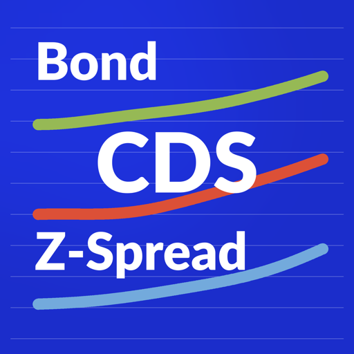
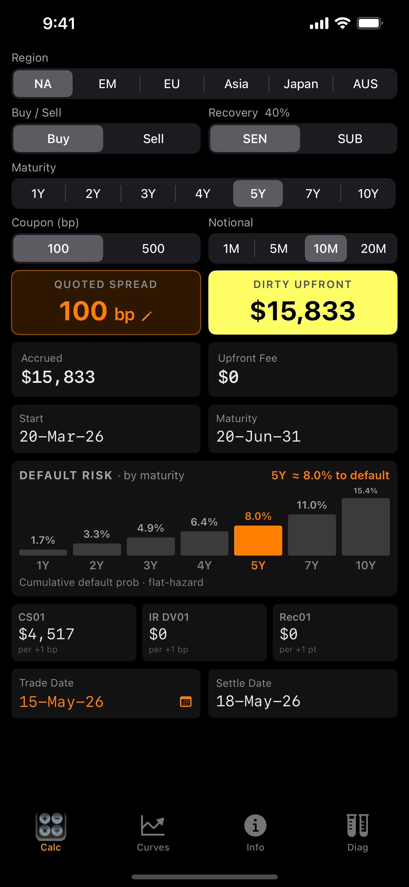

  

**iCDS** is a SNAC (Standard North American CDS) upfront fee calculator built on the [ISDA Standard CDS Model](https://www.cdsmodel.com). It mirrors the indicative-pricing workflow originally found on the Markit Partners CDS calculator.

The app is free. Its only objective is for the author to have a non-trivial application in the iPhone App Store.

It recalculates the upfront fee and intermediate results live as you change inputs — using quick-entry controls or the pickers reached by tapping the input buttons.

## Background

I started this project when as a 'former' Mac developer I was swept up by the excitement of the iPhone App phenomenon. This led me to a drive to get a non-trivial application into the App Store. I convinced my family to buy me a MacBookPro for my birthday in Sept, 2009 and about 20 hours of effort latter I had my first GUI prototype running on the simulator.

Along the way I have learned a lot about the rich environment of information sharing now happening in the development community. I was re-introduced to the Apple Development Tools (XCode) and the Snow Leopard OS. Not having touched MPW(Macintosh Programmers Workshop) in over 15 years, it was like I never left home with the added power of the underlying LINUX environment that I am well versed in using every day at work. I then was introduced to new resources including ITunes U, blogs and code.google.com.

###  [Read my Journal here](https://jimzucker.github.io/iCDS/Article_Build_Iphone.html)

## Feedback 
Please post feedback to ITunes!
For support please create a ticket at: https://github.com/jimzucker/iCDS/issues

# Release Notes

## 3.2.x (combines 3.2.0 and 3.2.1)
- **Now on Android** — full Flutter / Dart-FFI port with bit-identical numerical results to the iOS app. Available on Google Play.
- **More maturities** — 7 SNAC tenors (1Y / 2Y / 3Y / 4Y / 5Y / 7Y / 10Y) in a single segmented selector, up from the previous fixed grid.
- **Default-risk-by-maturity chart** — cumulative default probability implied by the quoted spread at each tenor; tap a bar to switch maturity.
- **First-order risk row** — CS01, IR DV01, and Rec01 computed by bump-and-reprice, so you can see sensitivity at a glance.
- **DIRTY UPFRONT card** — total cash to settle (upfront fee + accrued) labelled in trader-floor vocabulary; the unsigned components remain visible alongside.
- **In-app Diagnostics tab** — deterministic self-tests for the C engine, IMM helpers, regional holiday calendars, and live rate fetchers — verify everything works on any device.
- **Modernized SNAC conventions** — EM moves to T+1 settlement (was T+3); subordinated recoveries lowered (EM 25→15%, Japan 35→15%); Japan adds a 500 bp coupon.
- **Reliable JPY (TONA)** — retry strategy hardened so the monthly Japan rate breaks through FRED's slow paths consistently across both platforms.
- **CACHED status indicator** — Curves tab shows a cyan banner when a rate is from persisted cache (not freshly fetched), so the source of every rate is unambiguous.
- **Android Info-tab links fixed** — external URLs (Documentation, ISDA, Apache, Privacy) now actually launch on Android 11+.

## 3.0.1
- Apache 2.0 source license headers and full third-party attribution (ISDA model, central-bank rate sources)
- Expanded in-app disclaimers (not financial advice, AS IS, no liability, no affiliation)
- Working in-app links to the Apache 2.0 license and the documentation site
- "Documentation & Source" button on the Info screen
- Refreshed app icon
- GitHub Pages site for README and journal, with cleaned-up image links

## 3.0
- Live overnight reference rate curves from five central banks: USD SOFR, EUR €STR, GBP SONIA, JPY TONA (monthly proxy), AUD AONIA
- ISDA CDS Standard Model C library upgraded to v1.8.3 with full IR zero curve construction
- Six regional ISDA contracts: NA, EM, EU, Asia, Japan, AUS
- Rewritten UI in SwiftUI (Fee, Curves, Info tabs); spread input via preset chips + numeric keypad; spread cap raised to 10,000 bp
- ISDA RFR test grid validation across all five currencies
- Apache 2.0 source license; in-app disclaimers and full data attributions
- GitHub Pages site for README and journal

## 1.0
- SNAC (Standard North American CDS) upfront fee calculator using the ISDA Standard CDS Model

## License
Copyright © 2016-2026 James A. Zucker.

iCDS application source code is licensed under the **Apache License, Version 2.0** — see [LICENSE](LICENSE) or <https://www.apache.org/licenses/LICENSE-2.0>.

### Third-party components
- **ISDA CDS Standard Model** (C library, `icds/isdamodel/`) — © 2009 International Swaps and Derivatives Association, Inc. Licensed under the ISDA CDS Standard Model Public License — see [Licenses/ISDA_CDS_Standard_Model_Public_Licence_1.0.txt](Licenses/ISDA_CDS_Standard_Model_Public_Licence_1.0.txt). Available at <https://www.cdsmodel.com>.
- **Reference rates** are fetched live from public central-bank endpoints (NY Fed, ECB, BoE, FRED/St. Louis Fed, RBA) and used for indicative pricing only.

### Disclaimer
This app produces indicative pricing for educational purposes only. It is not financial, investment, or trading advice, is provided **AS IS** without warranty, and is not suitable for booking, settlement, or trading. Not affiliated with ISDA, Markit, JPMorgan Chase, or any rate provider.
